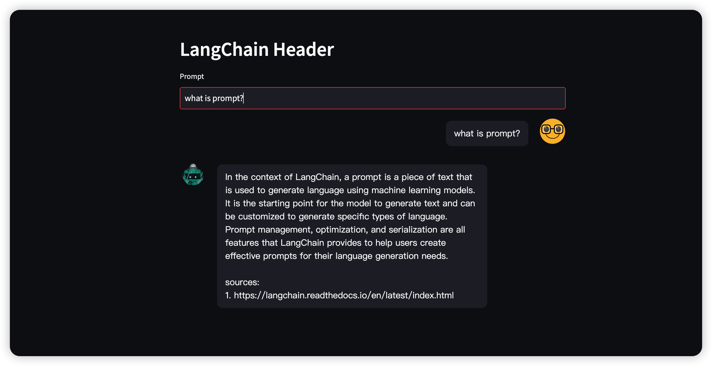

<!--
 * @Date: 2023-05-10 14:35:55
 * @Author: Bruce
 * @Description: 
-->
# 🦜️🔗 LangChain + </img>

## **Quick Start**

```
pip install -r requirements.txt

streamlit run main.py
```

## 📖 Documentation:

Please see [langchain](https://langchain.readthedocs.io/) for full documentation on :

- Getting started (installation, setting up the environment, simple examples)
- How to examples(demos, integrations, helper functions)
- Reference(full API docs)
- Resources(high-level explanation of core concepts)

Please see [streamlit](https://docs.streamlit.io/library/get-started) for full documentation on :

- Getting started
- Understand how that all works

## 👀 Results Show:



## 🚀 How to use streamlit

Create a new file `app.py` with the following code:

```python
import streamlit as st
x = st.slider("Select a value")
st.write(x, "squared is ", x * x)
```

Now run it to open the app!

```
$ streamlit run app.py
```

</img>
